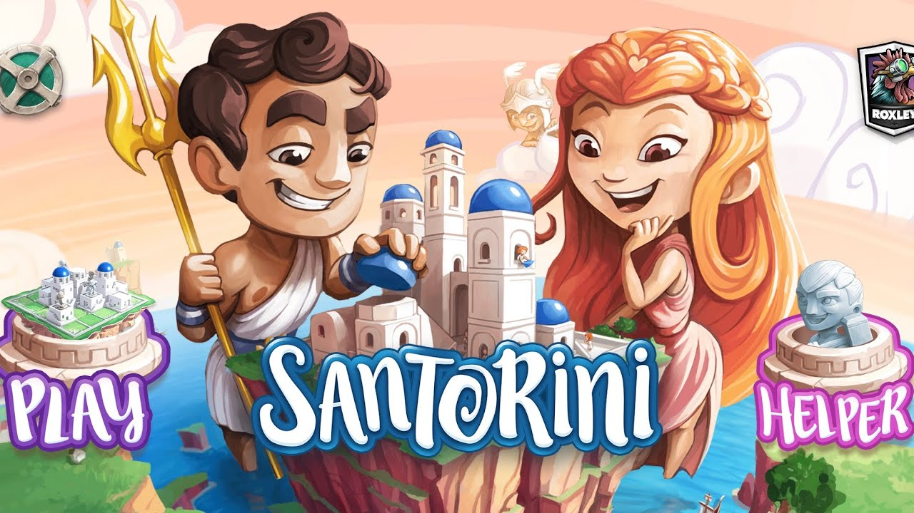

# Final Project of Software Engineering - a.a. 2019-2020


## List of Authors:

 - *Galzerano Arianna - Matricola: 886979*
 - *Giacomini Davide - Matricola: 889237*
 - *Leone Monica - Matricola 889321*
 
## Getting Started
This project was developed as a computer version of a game for the final examination of the Software Engineering course at Politecnico di Milano. 
The purpose of the project is the implementation of the board game Santorini with the use of the design Pattern Model View Controller for the realization of a design which follows the paradigm of object-oriented programming. The final result covers entirely the rules of the game and the interaction with the users is permitted through both a Graphical and a Command Line Interface. For the Network, a traditional approach based on the use of the Sockets was used.

More information about the game can be found [here](http://www.craniocreations.it/prodotto/santorini/)
## Prerequisites
The game requires [Java 8] to run.

## Docs
The following documentation includes all the significant documents created to show the work behind our project and an insight of our choices. Among this docs there are the UMLs, the Javadoc which describes the code and other useful links and instructions.

### UML
The following class diagrams are a representation of the design chosen by our group to implement the game, the initial ones shows the ideas on which we based the project that shape up in the final UMLs, divided into a general one and three more detailed ones for the most critical parts of the design.

- [Initial UML Model](https://github.com/davide-giacomini/Ing-Sw-2020-Galzerano-Giacomini-Leone/tree/master/deliveries/UML/InitialUML_Model.png)
- [Initial UML Controller and Network](https://github.com/davide-giacomini/Ing-Sw-2020-Galzerano-Giacomini-Leone/tree/master/deliveries/UML/InitialUML_Controller_and_Network.png)
- [Final UML](https://github.com/davide-giacomini/Ing-Sw-2020-Galzerano-Giacomini-Leone/tree/master/deliveries/UML/Total_FinalUML.png)
- [Final UML Model](https://github.com/davide-giacomini/Ing-Sw-2020-Galzerano-Giacomini-Leone/tree/master/deliveries/UML/Model_FinalUML.png)
- [Final UML Network](https://github.com/davide-giacomini/Ing-Sw-2020-Galzerano-Giacomini-Leone/tree/master/deliveries/UML/Network_FinalUML.png)
- [Final UML View](https://github.com/davide-giacomini/Ing-Sw-2020-Galzerano-Giacomini-Leone/tree/master/deliveries/UML/View_FinalUML.png)

### JavaDoc
The following documentation includes a description of all of the classes and methods implemented, based on the documentation generator for the Java language, which can be read at the following address: [Javadoc](https://github.com/davide-giacomini/Ing-Sw-2020-Galzerano-Giacomini-Leone/tree/master/deliveries/javaDoc)

### Coverage
To test the project a number of tests were executed, the percentages of coverage reached are over 90% for Controller and Model packages, as required from the project specifics.
More details are available at the following link: [Report Coverage](https://github.com/davide-giacomini/Ing-Sw-2020-Galzerano-Giacomini-Leone/tree/master/deliveries/finalCoverage)

<a name="built"></a>
## Built with
* [Java 8]
* [IntelliJ IDEA](https://www.jetbrains.com/idea/)
* [JavaFx](https://openjfx.io)
* [Maven](https://maven.apache.org)
* [JUnit](https://junit.org/junit5/)
* [Mockito](https://site.mockito.org)
* [Shade](https://maven.apache.org/plugins/maven-shade-plugin/)

### Libraries e Plugins
|Libraries/Plugin|Description|
|------------|-----------|
|__maven__|Project management tool that is based on POM (project object model)|
|__junit__|Unit testing framework for the Java programming language|
|__mockito__|Framework for the creation of test double objects (mock objects) in automated unit tests for the purpose of test-driven development|
|__JavaFx__|Java set of graphics and media packages|
|__shade__|Plugin which provides the capability to package the artifact in an uber-jar, including its dependencies|


### Jars
The following jars have been used for the delivery of the project, they can be used to run the game in accordance with the descriptions given in the introduction. The features realized following the Project-specific are listed in the following section while the details on how to run the system will be defined in the section __Execution of the jar__. The folder which contains Client and Server is at the following address : [Jars](https://github.com/davide-giacomini/Ing-Sw-2020-Galzerano-Giacomini-Leone/tree/master/deliveries/jar)

## Features
### Features developed
* Complete rules
* CLI
* GUI
* Socket

### Advanced features developed
* Multiple Games
* Advanced Gods:  **Chronus, Hera, Hestia, Triton, Zeus**  

## Execution of the JAR
### Client
In order to correctly run the client jar it is necessary to choose the jar for the Operative System in which it will be ran:
The client is executed with the command: 

For Macos:
```
java -jar mac_client.jar
```
For Windows:
```
java -jar windows_client.jar
```
After this line, on the terminal it is asked to the user to choose between the Command Line Interface and the Graphical User Interface (all the dependencies for JavaFx are included); The user will have to type one of this option as a word :
>GUI 
>
or 
>CLI
>

### Server
The execution of the server jar is possible through the following command:
```
java -jar server.jar 
```

### End
Enjoy and Have Fun! :)